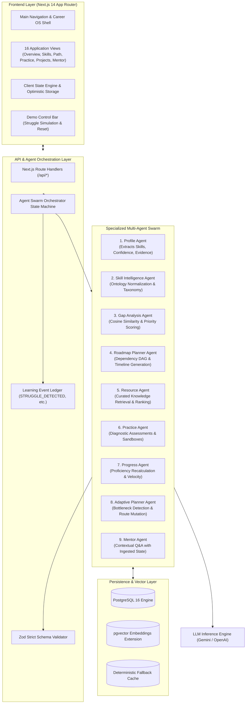

# EduPath - Technical Architecture & Multi-Agent Engine

This document details the architectural blueprints, multi-agent state machines, database schemas, and data flow pipelines powering **EduPath**.

---

## High-Level System Architecture



---

## The 9 Specialized Agents

| # | Agent Name | Core Responsibility | Input Schema | Output Schema |
| :--- | :--- | :--- | :--- | :--- |
| **1** | **Profile Agent** | Extracts structured capabilities from resume, project markdown, and portfolio files with confidence values and verbatim evidence quotes. | `{ rawText: string, fileType: string }` | `{ skills: SkillCapability[], experienceYears: number, projects: DetectedProject[] }` |
| **2** | **Skill Intelligence Agent** | Maps extracted raw terms into canonical skill nodes (e.g., "Postgres", "psql" $\to$ `PostgreSQL`). | `{ rawSkills: string[] }` | `{ normalizedSkills: NormalizedSkillNode[] }` |
| **3** | **Gap Analysis Agent** | Computes mathematical delta between learner vector and target role vector; assigns priority based on market frequency. | `{ userSkills: Skill[], targetRole: string }` | `{ gaps: SkillGap[], criticalCount: number, overallReadiness: number }` |
| **4** | **Roadmap Planner Agent** | Constructs a topological sort of learning milestones (Weeks/Phases) respecting prerequisite chains. | `{ gaps: SkillGap[], timeCommitmentMinPerDay: number }` | `{ milestones: RoadmapMilestone[], totalDurationWeeks: number }` |
| **5** | **Resource Agent** | Ranks verified, curated documentation, video tutorials, and interactive sandboxes. Prevents broken links. | `{ skill: string, difficulty: 'beginner' \| 'intermediate' \| 'advanced' }` | `{ resources: RankedResource[] }` |
| **6** | **Practice Agent** | Generates calibrated diagnostic questions (MCQs, code comprehension, debugging snippets) aligned to the learner's zone of proximal development. | `{ skill: string, currentLevel: number }` | `{ questions: DiagnosticQuestion[] }` |
| **7** | **Progress Agent** | Ingests practice outcomes, recalculates proficiency scores ($0.0 \to 1.0$), and tracks daily streaks and XP. | `{ practiceAttempts: PracticeResult[] }` | `{ updatedSkills: SkillProgress[], velocityScore: number }` |
| **8** | **Adaptive Planner Agent** | Detects consecutive failures ($2+$ failed queries on a sub-concept), generates an explainable decision card, and mutates the downstream roadmap DAG. | `{ failedConcepts: string[], activeRoadmap: RoadmapMilestone[] }` | `{ action: 'reinforce' \| 'accelerate' \| 'reorder', mutatedRoadmap: RoadmapMilestone[], decisionReceipt: DecisionReceipt }` |
| **9** | **Mentor Agent** | Contextual career coach equipped with full awareness of active bottlenecks, postponed skills, and target role criteria. | `{ userPrompt: string, learnerContext: FullLearnerState }` | `{ reply: string, suggestedAction: string, referencedNodeId: string }` |

---

## Adaptive Replanning State Machine

```mermaid
stateDiagram-v2
    [*] --> Observing: User Starts Practice
    Observing --> Evaluating: Practice Result Received
    Evaluating --> NormalProgress: Accuracy >= 70%
    NormalProgress --> UpdateProficiency: Increment Skill Level (+0.08)
    UpdateProficiency --> Observing: Next Roadmap Task
    
    Evaluating --> BottleneckDetected: 2+ Consecutive Failures on Sub-concept
    BottleneckDetected --> AdaptiveAgentInvoked: Ingest Failed Attempts & Evidence
    AdaptiveAgentInvoked --> SynthesizeRecovery: Generate Focused Recovery Module
    SynthesizeRecovery --> MutateRoadmap: Insert Prerequisites & Shift Downstream Deadlines
    MutateRoadmap --> GenerateExplainability: Create "Why did my plan change?" Receipt
    GenerateExplainability --> Observing: User Enters Recovery Mission
```



---

## Database Schema (PostgreSQL + pgvector)

```sql
-- Enable pgvector extension
CREATE EXTENSION IF NOT EXISTS "uuid-ossp";
CREATE EXTENSION IF NOT EXISTS "vector";

-- Users Table
CREATE TABLE users (
    id UUID PRIMARY KEY DEFAULT uuid_generate_v4(),
    email VARCHAR(255) UNIQUE NOT NULL,
    full_name VARCHAR(255) NOT NULL,
    created_at TIMESTAMP WITH TIME ZONE DEFAULT CURRENT_TIMESTAMP,
    updated_at TIMESTAMP WITH TIME ZONE DEFAULT CURRENT_TIMESTAMP
);

-- Profiles Table
CREATE TABLE profiles (
    id UUID PRIMARY KEY DEFAULT uuid_generate_v4(),
    user_id UUID REFERENCES users(id) ON DELETE CASCADE,
    target_role VARCHAR(100) NOT NULL,
    experience_level VARCHAR(50) NOT NULL,
    preferred_learning_style VARCHAR(50) DEFAULT 'mixed',
    daily_time_minutes INT DEFAULT 30,
    readiness_percentage INT DEFAULT 0,
    created_at TIMESTAMP WITH TIME ZONE DEFAULT CURRENT_TIMESTAMP
);

-- Skills & Evidence Table
CREATE TABLE skills (
    id UUID PRIMARY KEY DEFAULT uuid_generate_v4(),
    user_id UUID REFERENCES users(id) ON DELETE CASCADE,
    name VARCHAR(100) NOT NULL,
    estimated_level FLOAT NOT NULL CHECK (estimated_level >= 0.0 AND estimated_level <= 1.0),
    confidence FLOAT NOT NULL CHECK (confidence >= 0.0 AND confidence <= 1.0),
    target_benchmark FLOAT NOT NULL,
    status VARCHAR(50) NOT NULL, -- 'mastered', 'developing', 'gap', 'unknown'
    last_validated TIMESTAMP WITH TIME ZONE DEFAULT CURRENT_TIMESTAMP
);

CREATE TABLE skill_evidence (
    id UUID PRIMARY KEY DEFAULT uuid_generate_v4(),
    skill_id UUID REFERENCES skills(id) ON DELETE CASCADE,
    source_type VARCHAR(50) NOT NULL, -- 'resume', 'project', 'practice', 'certificate'
    quote_or_description TEXT NOT NULL,
    verified BOOLEAN DEFAULT FALSE,
    created_at TIMESTAMP WITH TIME ZONE DEFAULT CURRENT_TIMESTAMP
);

-- Learning Roadmap Table
CREATE TABLE learning_plans (
    id UUID PRIMARY KEY DEFAULT uuid_generate_v4(),
    user_id UUID REFERENCES users(id) ON DELETE CASCADE,
    title VARCHAR(255) NOT NULL,
    version INT DEFAULT 1,
    is_active BOOLEAN DEFAULT TRUE,
    created_at TIMESTAMP WITH TIME ZONE DEFAULT CURRENT_TIMESTAMP
);

CREATE TABLE roadmap_items (
    id UUID PRIMARY KEY DEFAULT uuid_generate_v4(),
    plan_id UUID REFERENCES learning_plans(id) ON DELETE CASCADE,
    week_number INT NOT NULL,
    title VARCHAR(255) NOT NULL,
    objective TEXT NOT NULL,
    skill_focus VARCHAR(100) NOT NULL,
    priority VARCHAR(50) DEFAULT 'medium',
    status VARCHAR(50) DEFAULT 'upcoming', -- 'completed', 'active', 'upcoming', 'delayed'
    is_recovery_module BOOLEAN DEFAULT FALSE,
    estimated_minutes INT DEFAULT 45,
    sort_order INT NOT NULL
);

-- Practice Attempts Table
CREATE TABLE practice_attempts (
    id UUID PRIMARY KEY DEFAULT uuid_generate_v4(),
    user_id UUID REFERENCES users(id) ON DELETE CASCADE,
    skill VARCHAR(100) NOT NULL,
    sub_concept VARCHAR(100) NOT NULL,
    question_prompt TEXT NOT NULL,
    selected_option INT NOT NULL,
    is_correct BOOLEAN NOT NULL,
    difficulty VARCHAR(50) NOT NULL,
    attempt_timestamp TIMESTAMP WITH TIME ZONE DEFAULT CURRENT_TIMESTAMP
);

-- Adaptive Decision Log Table
CREATE TABLE roadmap_changes (
    id UUID PRIMARY KEY DEFAULT uuid_generate_v4(),
    user_id UUID REFERENCES users(id) ON DELETE CASCADE,
    trigger_reason TEXT NOT NULL,
    evidence_summary TEXT NOT NULL,
    decision_text TEXT NOT NULL,
    action_taken TEXT NOT NULL,
    impact_summary TEXT NOT NULL,
    created_at TIMESTAMP WITH TIME ZONE DEFAULT CURRENT_TIMESTAMP
);

-- Curated Resources with Embeddings
CREATE TABLE resources (
    id UUID PRIMARY KEY DEFAULT uuid_generate_v4(),
    title VARCHAR(255) NOT NULL,
    url VARCHAR(500) NOT NULL,
    resource_type VARCHAR(50) NOT NULL, -- 'documentation', 'video', 'interactive', 'article'
    skill VARCHAR(100) NOT NULL,
    difficulty VARCHAR(50) NOT NULL,
    estimated_minutes INT NOT NULL,
    embedding vector(1536) -- OpenAI or Gemini vector embedding
);
```
